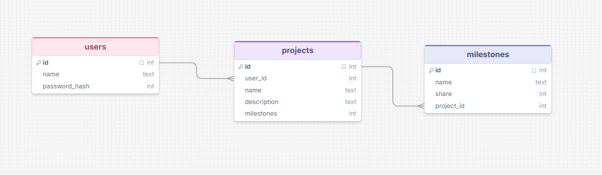

# Sprint 1 - Developing a DB and UI Prototype

## Sprint Goals

Develop a design for the database and a UI prototype that simulates the key functionality of the system. Test and refine the UI so that it can serve as the model for the next phase of development in Sprint 2.

### Specific Goals

**Edit these goals as needed**

- Design the database:
    - Tables
    - Fields / types
    - Primary keys
    - Default / nullable values
    - Relationships (foreign keys)
- Design the UI
    - Key pages
    - User interactions and 'flow'
    - Page layouts / features
    - Colour palette
    - Etc.

## Initial Database Design

So far my database has three tables, one for user accounts, one for projects, and one for milestones in projects.

### Required Data Input

For accounts I need a username and password. which will be submited by an user on the sign up page. For projects I need an user ID, name, description, milestones with a percentage attached, user ID will be taken from the user creating the project, while they will have to manually submit the other values using a text box for name, description, and milestones, plus a slider for the attached percentage.

### Required Data Output

My website will display the data in the project and mileston tables, excluding the user_id column on the projects table, and the id and project_id columns on the milestones table.

### Required Data Processing

When the user inputs a password when signing up and logging in it will need to be hashed before it is stored in the database.

## Initial UI Prototype

Prototyping a layout for each screen of the UI to see what features are still needed and how useability can be improved.

This Figma demo shows the initial layout design for the UI:

[UI Prototype](https://design.penpot.app/#/view?file-id=f0485fb1-4e63-8165-8008-3908ef3fa4ef&page-id=f0485fb1-4e63-8165-8008-3908ef3fa4f0&section=interactions&index=0&share-id=3be9e5e1-190f-8090-8008-717ebf12c2e7)

### Testing

After testing and receiving feedback I've decided that I need more customizeable accounts, which I will probably be renaming to: "Organisations" I should also add a page specifically for editing already existing accounts 

### Changes / Improvements

Replace this text with notes any improvements you made as a result of the testing.

*FIGMA IMPROVED PROTOTYPE - PLACE THE FIGMA EMBED CODE HERE - MAKE SURE IT IS SET SO THAT EVERYONE CAN ACCESS IT*

## Refined UI Prototype

Having established the layout of the UI screens, the prototype was refined visually, in terms of colour, fonts, etc.

This Figma demo shows the UI with refinements applied:

*FIGMA REFINED PROTOTYPE - PLACE THE FIGMA EMBED CODE HERE - MAKE SURE IT IS SET SO THAT EVERYONE CAN ACCESS IT*

### Testing

Replace this text with notes about what you did to test the UI flow and the outcome of the testing.

### Changes / Improvements

Replace this text with notes any improvements you made as a result of the testing.

*FIGMA IMPROVED REFINED PROTOTYPE - PLACE THE FIGMA EMBED CODE HERE - MAKE SURE IT IS SET SO THAT EVERYONE CAN ACCESS IT*

## Sprint Review

Replace this text with a statement about how the sprint has moved the project forward - key success point, any things that didn't go so well, etc.

